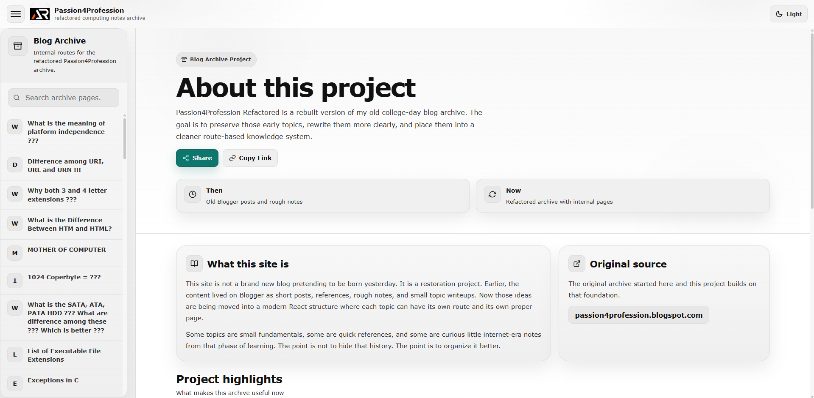

# Passion4Profession Refactored



A refactored and expanded version of the original Passion4Profession blog where I used to write about computer concepts during my college days.

The goal of this project is to preserve those early ideas and rewrite them in a clearer, more structured, and modern format.

This repository contains beginner friendly explanations of fundamental computing concepts including hardware, software, networking, storage, programming, and core computer science topics.

The content is rewritten, expanded, and organized to make it easier for learners to understand the foundations of computing.

## Live Website

https://a2rp.github.io/passion4profession-refactored/

## About This Project

The original blog was created during my college days:

https://passion4profession.blogspot.com/

I don't do anything there anymore. So, any links given there are of no use.

Many posts were short notes explaining basic concepts like bits, bytes, storage units, hardware interfaces, and other computing fundamentals.

In this repository those ideas are:

- rewritten with clearer explanations
- expanded with examples
- organized into structured topics
- corrected and updated where necessary
- presented through a modern React based interface

## Project Goals

- Preserve the original ideas from the early blog
- Improve clarity and accuracy of explanations
- Organize topics in a logical learning structure
- Build a clean technical knowledge reference
- Make concepts beginner friendly

## Topics Covered

Some of the topics included in this project:

- Bits and Bytes
- Storage Units (KB MB GB TB)
- Computer Hardware Basics
- Storage Devices and Interfaces
- Platform Independence
- Memory vs Storage
- Operating System Basics
- Networking Fundamentals
- Web and Programming Foundations

More topics will be added and improved over time.

## Tech Stack

This project is built using:

- React
- Vite
- styled-components
- react-icons

---

Each topic is written as a separate component and structured to make concepts easy to explore.

---

## Running Locally

- Clone the repository:

```bash
git clone https://github.com/a2rp/passion4profession-refactored.git
```

- Move into the project directory:

```bash
cd passion4profession-refactored
```

- Install dependencies:

```bash
npm install

# Start the development server:
npm run dev

## Build

# To create a production build:

npm run build
```

## Deployment

---

This project is deployed using GitHub Pages.

## Follow Me

- GitHub https://github.com/a2rp
- Portfolio https://www.ashishranjan.net
- LinkedIn https://www.linkedin.com/in/aashishranjan
- Facebook https://www.facebook.com/theash.ashish/
- Youtube https://www.youtube.com/@ashishranjan-ashz

---

a2rp: an Ashish Ranjan presentation
