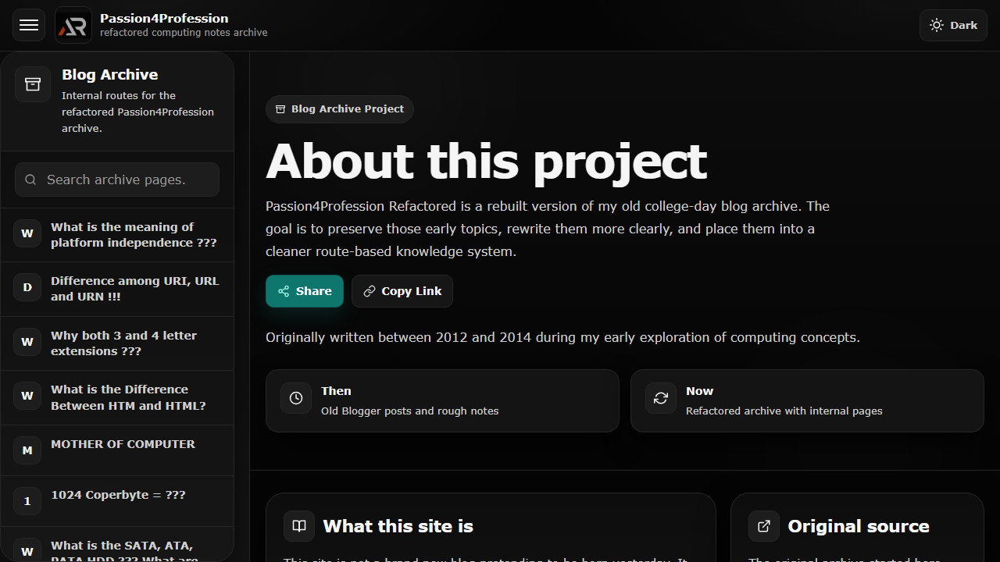

# Passion4Profession Refactored

A React and Vite archive that preserves and reorganizes beginner-friendly computing notes from the original Passion4Profession blog.

## Features

- Searchable archive navigation for computing topics
- Lazy-loaded pages for a focused reading experience
- Responsive sidebar with active topic scrolling
- Dark and light themes saved in local storage
- Topic pages for hardware, software, networking, storage, programming, and reference material
- Icon-only social and support links with a floating scroll-to-top control

## Tech stack

- React
- Vite
- React Router
- styled-components
- Material UI
- react-icons

## Run locally

\`\`\`bash
npm install
npm run dev
\`\`\`

Build and deploy:

\`\`\`bash
npm run build
npm run deploy
\`\`\`

## Live website

[Open Passion4Profession Refactored](https://a2rp.github.io/passion4profession-refactored/)

## Future scope

The archive can grow with improved search, topic grouping, reading progress, and more carefully expanded reference pages.

## Links

- Portfolio: [ashishranjan.net](https://www.ashishranjan.net/)
- GitHub: [github.com/a2rp](https://github.com/a2rp)
- CodePen: [codepen.io/ash1198](https://codepen.io/ash1198)
- LinkedIn: [linkedin.com/in/aashishranjan](https://www.linkedin.com/in/aashishranjan)
- Facebook: [facebook.com/theash.ashish](https://www.facebook.com/theash.ashish/)
- YouTube: [youtube.com/@ashishranjan-ashz](https://www.youtube.com/@ashishranjan-ashz?sub_confirmation=1)
- Email: [ash.ranjan09@gmail.com](mailto:ash.ranjan09@gmail.com)

## Support

- Support: [a2rp-donation-page.netlify.app](https://a2rp-donation-page.netlify.app/)
- Buy Me a Coffee: [buymeacoffee.com/a2rp](https://buymeacoffee.com/a2rp)
- Patreon: [patreon.com/a2rp](https://www.patreon.com/a2rp)
